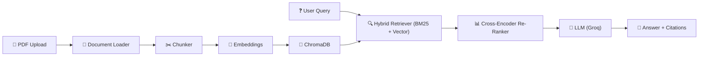

# Ask My Docs — Production-Grade RAG System

**Ask My Docs** is a domain-specific **Retrieval-Augmented Generation (RAG)** system. You upload documents (PDFs, text files, markdown), and it lets you ask natural language questions — returning AI-generated answers with **inline citations** back to the source documents, ensuring trustworthiness and minimizing hallucinations.

##  Features
- **Multi-format Document Support**: Load PDF, Markdown, and TXT files.
- **Intelligent Chunking**: 600-token chunks with ~100-token overlap, using UUIDs for unique chunk identification.
- **Hybrid Retrieval (RRF)**: Combines BM25 keyword search (sparse) and vector similarity (dense) using Reciprocal Rank Fusion for perfect recall.
- **Cross-Encoder Re-Ranking**: Uses `ms-marco-MiniLM-L-6-v2` to mathematically re-rank retrieved chunks for maximum context precision.
- **Offline Evaluation (Ragas)**: Fully automated CI/CD pipeline scoring using `llama-3.3-70b-versatile` to mathematically prove Faithfulness and Recall.
- **LangSmith Tracing**: Full observability into LLM traces, token usage, and latency.
- **Inline Citations**: Ensures answers are grounded in source documents, linking text back to the exact chunk.
- **Zero-Hallucination Guardrails**: System refuses to answer when the information isn't found in the documents.
- **Local Embeddings**: Uses `all-MiniLM-L6-v2` locally for fast, free, and private embedding.
- **Minimal Streamlit UI**: A clean, premium user interface with database clearing functionality.

---

##  Architecture (End-to-End Pipeline)



| Stage | What Happens |
|-------|-------------|
| **Ingest** | PDF/TXT/MD files are loaded and parsed into raw text |
| **Chunk** | Text is split into 600-token chunks with 100-token overlap, assigning unique UUIDs |
| **Embed** | Each chunk is converted to a 384-dim vector using SentenceTransformer |
| **Store** | Vectors + metadata (e.g., `source_file`) are persisted in ChromaDB |
| **Retrieve** | User query is searched against vectors and BM25, merged via Reciprocal Rank Fusion (RRF) |
| **Re-Rank** | A Cross-Encoder model re-scores and re-ranks the candidate chunks |
| **Generate** | Top-K refined chunks are sent to Groq LLM as context to generate a grounded answer |
| **Evaluate** | `Ragas` evaluates the generated answer against the Golden Dataset for CI/CD checks |

---

## 🛠 Tech Stack Breakdown

- **LLM Provider**: **Groq** (`llama-3.1-8b-instant` for generation, `llama-3.3-70b-versatile` for evaluation)
- **Embeddings**: **SentenceTransformers** (`all-MiniLM-L6-v2`)
- **Re-Ranking**: **SentenceTransformers Cross-Encoder** (`ms-marco-MiniLM-L-6-v2`)
- **Vector Database**: **ChromaDB** - Persistent vector store with SQLite backend.
- **Orchestration & Tracing**: **LangChain** & **LangSmith**
- **Evaluation**: **Ragas** - Automated metric grading (Faithfulness, Relevancy, Precision, Recall).
- **Frontend**: **Streamlit** - Clean UI with PDF upload, query box, and response display.
- **Testing & CI/CD**: **Pytest** & **GitHub Actions** - Automated tests and Quality Gates.

---

## 🚀 Setup Instructions

### Prerequisites
- Python 3.9+
- Groq API key (for fast LLM responses)

### Installation

1. **Clone the repository**:
```bash
git clone <repository-url>
cd ask-my-docs
```

2. **Set up a virtual environment**:
```bash
python -m venv venv
# Windows
venv\Scripts\activate
# Unix/MacOS
source venv/bin/activate
```

3. **Install dependencies**:
```bash
pip install -r requirements.txt
```

4. **Configure environment variables**:
Copy the example environment file and add your Groq API key:
```bash
cp .env.example .env
```
Open `.env` and configure:
```env
LLM_PROVIDER=groq
GROQ_API_KEY=your_groq_api_key_here
LLM_MODEL=llama-3.1-8b-instant
```

### Running the App

Start the Streamlit dashboard:
```bash
python -m streamlit run scripts/app.py --browser.gatherUsageStats=false
```
Open your browser at `http://localhost:8501`.

### Using the CLI (Interactive Testing)

You can instantly test your documents from the terminal without launching the UI:
1. Place your PDF/TXT files in the `data/sample_docs/` folder.
2. Run the interactive CLI wrapper:
```bash
python scripts/demo.py
```
This command automatically loads your documents, chunks them, stores them in ChromaDB, and drops you into a live `Ask a question:` prompt. The terminal will directly output the AI's response along with exact inline citations!

### Running Tests
To run the full suite of 33 unit and integration tests:
```bash
pytest
```

---

## 📂 Project Structure

```text
ask-my-docs/
├── scripts/
│   ├── app.py              # Streamlit UI (minimal)
│   ├── demo.py             # RAGPipeline orchestrator class
│   └── evaluate.py         # Evaluation runner
├── src/
│   ├── config/settings.py  # Pydantic settings from .env
│   ├── ingestion/
│   │   ├── loaders.py      # PDF/TXT/MD document loaders
│   │   └── chunking.py     # Text chunking with overlap (UUID based)
│   ├── storage/
│   │   └── vector_store.py # ChromaDB + SentenceTransformer embeddings
│   ├── retrieval/
│   │   ├── hybrid_retriever.py # Vector, BM25, and RRF fusion search
│   │   └── reranker.py         # Cross-Encoder model re-ranking
│   ├── rag/
│   │   └── answer_generator.py # LLM answer generation with citations
│   └── evaluation/
│       ├── citation_validator.py  # Answer quality checks
│       └── golden_dataset.py      # Benchmark dataset generator
├── tests/                  # 33 pytest tests
├── data/
│   ├── chroma_db/          # Persistent vector store
│   ├── sample_docs/        # Pre-loaded sample documents
│   └── uploaded_docs/      # User-uploaded PDFs
├── config/prompts.yaml     # Customizable prompt templates
├── .env                    # API keys and configuration
└── requirements.txt        # Python dependencies
```
